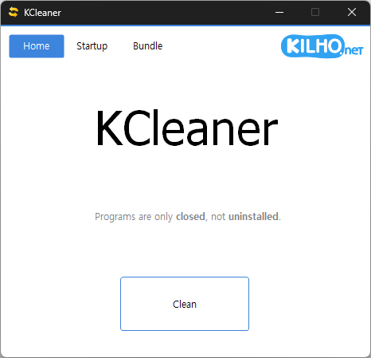

# KCleaner

**Limpiador gratuito de PC para Windows: con un solo clic cierra todos los programas innecesarios y deja solo lo que Windows realmente necesita, y en el mismo lugar ordena los elementos de inicio automático, los archivos sobrantes y los programas de seguridad instalados a la fuerza.**

[English](README.md) · [한국어](README.ko.md) · [简体中文](README.zh-CN.md) · [日本語](README.ja.md) · Español · [Português (Brasil)](README.pt-BR.md) · [Français](README.fr.md)

> Este documento es una traducción. Si hay alguna diferencia, la [versión en coreano](README.ko.md) es la que prevalece.

-0078D4)

## Descripción general

Si deja el equipo encendido un buen rato, acaban funcionando en segundo plano muchísimos programas: mensajería, asistentes de actualización, programas que usó y no cerró, e incluso programas de seguridad que le obligaron a instalar sitios de bancos. Buscarlos y cerrarlos uno por uno es tedioso.

Con un solo clic en **Limpiar** en la pestaña **Inicio**, KCleaner cierra todo excepto los programas que Windows necesita para funcionar y después libera la memoria restante. Los controladores esenciales, como los de gráficos y sonido, y los antivirus de confianza no se cierran; los programas que se disfrazan con el mismo nombre que los programas del sistema de Windows sí se cierran. Los programas solo se cierran, nunca se desinstalan.

Además, incluye tres herramientas de limpieza en pestañas:

- **Programas de inicio** — desactiva, sin borrarlos, los programas, tareas programadas y servicios que arrancan con Windows.
- **Limpieza** — elige y elimina restos como cachés y archivos temporales que dejan las aplicaciones instaladas.
- **Paquete** — encuentra y quita los programas de seguridad que sitios de bancos y organismos públicos le pidieron instalar.

## Funciones principales

- **Cerrar todo de una vez** — Un botón cierra todos los programas excepto los esenciales.
- **Criterios seguros** — Se conservan los programas esenciales de Windows, los controladores de gráficos y sonido y los antivirus de confianza. Los falsos programas del sistema que solo imitan nombres de Windows se cierran.
- **Limpieza de memoria** — Una vez cerrados los programas, se libera la memoria restante.
- **Lista de excepciones** — Puede indicar usted mismo los programas que deben seguir abiertos para que no se cierren.
- **Resultados** — Al terminar la limpieza se abre una página de resultados con los programas cerrados y el cambio en la memoria.
- **Gestión del inicio** — Active o desactive desde una sola lista los elementos de inicio automático repartidos entre carpetas de inicio, registro, Programador de tareas y servicios.
- **Limpieza de archivos sobrantes** — Analiza y elimina cachés, archivos temporales y registros solo de las aplicaciones instaladas en este equipo. Los registros personales, como marcadores, contraseñas e historial de navegación, no se marcan por defecto.
- **Quitar programas instalados a la fuerza** — Muestra en una lista los programas de seguridad de bancos y organismos públicos y ejecuta su desinstalador con un botón.
- **Icono en la bandeja** — La versión instalada espera en el área de notificación al iniciar sesión y se abre con un clic.
- **Modo oscuro** — Los colores siguen el modo de aplicación de Windows (claro · oscuro).
- **9 idiomas** — Coreano · inglés · japonés · chino · ruso · italiano · francés · español · árabe.

## Descarga / Instalación

| Tipo | Enlace |
|---|---|
| Instalador | [Descargar](https://down.kilho.net/kcleaner?lang=es) |
| Portátil (ZIP) | [Descargar](https://down.kilho.net/kcleaner?lang=es&nosetup) |

El instalador abre KCleaner en cuanto termina la instalación y coloca un icono en el área de notificación. En la versión portátil, descomprima el ZIP y ejecute `KCleaner.exe`. Las dos versiones limpian igual; solo la versión instalada tiene el icono en la bandeja.

Cerrar programas y cambiar los elementos de inicio automático requiere permisos de administrador, por lo que Windows muestra una ventana de confirmación de administrador al ejecutarlo. Pulse **Sí**.

## Uso

### Primeros pasos

1. Si tiene documentos abiertos o trabajo sin terminar, guárdelo primero. Se cerrarán todos los programas no esenciales, incluidos los navegadores y la mensajería.
2. Ejecute KCleaner y pulse **Sí** en la ventana de confirmación de administrador.
3. En la pestaña **Inicio**, pulse **Limpiar**.
4. Donde estaba el botón gira un indicador de progreso mientras se cierran los programas innecesarios y se limpia la memoria.
5. Al terminar, se abre en el navegador la página de resultados y la ventana de KCleaner se cierra sola.

### Distribución de la pantalla

| Elemento | Función |
|---|---|
| **Inicio** | La primera pantalla, con el botón **Limpiar** |
| **Programas de inicio** | Activar y desactivar los elementos que arrancan con Windows |
| **Limpieza** | Analizar y eliminar archivos sobrantes de las aplicaciones instaladas |
| **Paquete** | Quitar programas de seguridad de bancos y organismos públicos |
| Logotipo KILHO.net | Abre la página de KCleaner |

Cada pestaña carga su lista la primera vez que la abre. Si solo usa **Limpiar** en **Inicio**, no necesita abrir las demás pestañas.

**Programas de inicio**

| Elemento | Función |
|---|---|
| Columna **Programa** | Icono y nombre del programa (el nombre del producto, si lo tiene) |
| Columna **Origen** | Dónde está registrado el elemento — **Inicio** (carpeta de inicio) · **Registro** · **Tarea** · **Servicio** |
| Fila atenuada | Un elemento desactivado |
| **Todos los programas** | Si se marca, muestra todo, incluidos los elementos desactivados |
| **Desactivar** / **Habilitar** | Desactiva o activa el elemento seleccionado |
| Menú contextual | **Eliminar** (solo elementos desactivados) · **Guardar lista** |

**Limpieza**

| Elemento | Función |
|---|---|
| Fila de categoría | **Windows** · nombres de navegadores · **Internet** · **Multimedia** · **Utilidades** · **Aplicaciones** · **Juegos** · **Otros**. Haga clic para expandir o contraer |
| Fila de elemento | Un tipo de resto que se puede eliminar. Solo se analizan y limpian los marcados |
| Signo de exclamación | Un elemento que requiere cuidado antes de eliminarlo. Pase el ratón por encima para ver una nota (en inglés) |
| Columna **Tamaño** | Lo que se puede eliminar, tras **Analizar** |
| Texto inferior | Número de aplicaciones instaladas, progreso y resultados del análisis o la limpieza |
| **Analizar** / **Limpiar** | Busca lo que se puede eliminar y muestra su tamaño / elimina lo analizado |
| Menú contextual | **Seleccionar todo** · **Deseleccionar todo** · **Restaurar predeterminados** |

**Paquete**

| Elemento | Función |
|---|---|
| Columna **Programa** | Programas de seguridad de bancos y organismos públicos instalados en este equipo |
| Columna **Origen** | El editor (**Desconocido** si no hay información) |
| **Desinstalar todo** | Ejecuta el desinstalador del programa seleccionado |

### Qué hacer cuando…

**El equipo va lento y quiere limpiarlo de una vez**
Pulse **Limpiar** en la pestaña **Inicio**. Los programas que funcionaban en segundo plano se cierran a la vez y se libera memoria. Los programas solo se cierran, no se borran, así que puede volver a abrir los que necesite y usarlos como siempre.

**Antes de pulsar Limpiar**
Los programas no esenciales —navegadores, mensajería, editores de documentos, etc.— se cierran aunque estén abiertos. Si tiene trabajo sin guardar, guárdelo primero. El Explorador de Windows y el escritorio, los controladores de gráficos y sonido y los antivirus de confianza siguen funcionando.

**Hay programas que deben seguir abiertos (lista de excepciones)**
En la versión instalada, haga clic derecho en el icono de KCleaner del área de notificación → **WhiteList**. Se abre el Bloc de notas; escriba los programas que no deben cerrarse, uno por línea, y guarde.

- `programa.exe*` — el programa cuyo nombre de archivo ejecutable coincide exactamente (p. ej., `editplus.exe*`)
- Sin `*` — todos los programas cuya ruta contiene ese texto (p. ej., `\EditPlus\` abarca todos los programas de esa carpeta)

A partir de la próxima vez que pulse **Limpiar**, los programas de la lista no se cerrarán. En la versión portátil, cree `NoClean.txt` junto a `KCleaner.exe` y escríbalo de la misma forma.

**Ver los resultados**
Al terminar la limpieza se abre en el navegador una página de resultados con los programas cerrados y la memoria antes y después. La ventana de KCleaner se cierra sola cuando acaba su trabajo.

**Abrirlo directamente desde el icono de la bandeja**
En la versión instalada, el icono de KCleaner aparece en el área de notificación poco después de iniciar sesión. Haga clic izquierdo para abrir KCleaner; si ya está abierto, su ventana pasa al frente. El menú del clic derecho tiene **KCleaner** · **WhiteList** · **About** · **Quit** (este menú se muestra en inglés). **Quit** quita el icono hasta el próximo inicio de sesión.

**Desactivar programas que arrancan con Windows**
En la pestaña **Programas de inicio**, haga clic en el programa y pulse **Desactivar**. El elemento no se borra, solo se desactiva: deja de arrancar a partir del siguiente inicio y el programa funciona igual que antes. La fila queda en su sitio, atenuada, para que pueda volver a activarla al momento con **Habilitar**.

**Volver a activar un elemento desactivado**
En la pestaña **Programas de inicio**, marque **Todos los programas** y los elementos que desactivó antes aparecerán como filas atenuadas. Haga clic en la fila y pulse **Habilitar**: se ejecutará de nuevo a partir del siguiente inicio.

**Desactivar tareas de actualización y servicios**
Las filas cuyo **Origen** es **Tarea** se ejecutan automáticamente a horas fijas; las filas **Servicio** son servicios en segundo plano que arrancan con Windows. **Desactivar** impide que una tarea se ejecute aunque llegue su hora, y que un servicio arranque al iniciar Windows o cuando otro programa lo llama. Conviene comprobar a qué programa pertenece un servicio antes de desactivarlo.

**No sabe qué es un elemento de inicio**
Haga doble clic en la fila y el navegador se abrirá con información sobre ese elemento.

**Quedan entradas de inicio de un programa desinstalado**
Primero cambie la fila a **Desactivar**, luego haga clic derecho → **Eliminar** y pulse **Sí** para confirmar. Los elementos eliminados no se pueden recuperar, así que elimine solo lo que tenga claro que no necesita. Al eliminar un servicio aparece el aviso "Un servicio en ejecución se elimina por completo después de reiniciar": reinicie el equipo una vez y desaparecerá del todo.

**Guardar una copia de la lista de inicio**
En la pestaña **Programas de inicio**, haga clic derecho → **Guardar lista** para guardar en un archivo de texto todos los elementos de inicio automático, incluidos los elementos esenciales de Windows ocultos en la lista. Los servicios y tareas que Windows necesita están ocultos desde el principio para que no los desactive por error, y siguen ocultos aunque marque **Todos los programas**.

**Recuperar espacio en disco eliminando archivos sobrantes**
La primera vez que abre la pestaña **Limpieza**, KCleaner busca las aplicaciones instaladas en este equipo, lo indica como **N aplicaciones instaladas** y muestra por categorías solo los elementos de limpieza de esas aplicaciones. Deje las marcas predeterminadas y pulse **Analizar** para ver qué archivos se eliminarían y cuánto ocupan; pulse **Limpiar** para eliminar lo analizado. **Analizar** no elimina nada, así que puede usarlo solo para ver cuánto espacio podría liberar.

**Elegir usted mismo qué eliminar**
Haga clic en una fila de categoría para expandirla y ver sus elementos; haga clic en una fila de elemento para cambiar su marca. La casilla de una fila de categoría marca o desmarca toda la categoría a la vez, y se vuelve gris cuando solo hay algunos elementos marcados. Los cambios se recuerdan y se usan la próxima vez que abra la pestaña. Para volver al estado inicial, haga clic derecho en la lista → **Restaurar predeterminados**.

**También quiere borrar el historial de navegación o las listas de archivos recientes**
Los registros que usted ha creado —marcadores, favoritos, contraseñas, historial de navegación web, historial de chat— no se marcan por defecto para que no se borren por error. En las aplicaciones que mezclan cachés con listas de archivos recientes hay un elemento aparte llamado **… · Historial de uso**. Si quiere borrar también esos registros, márquelo usted mismo.

**No se puede pulsar Limpiar**
**Limpiar** solo se activa cuando todos los elementos marcados se han **Analizado** y hay algo que eliminar. Si marcó elementos nuevos después de analizar, o acaba de terminar una limpieza, pulse **Analizar** una vez más.

**Elementos con un signo de exclamación**
Son elementos con algo que conviene saber antes de eliminarlos. Pase el ratón por encima del signo para leer la nota (en inglés); si hay alguno marcado, se le pedirá confirmación al pulsar **Limpiar**.

**El navegador está abierto**
Los archivos en uso no se tocan y se omiten. Para vaciar más caché del navegador, ciérrelo antes de limpiar, o pulse primero **Limpiar** en la pestaña **Inicio** y después haga la limpieza.

**¿Están seguros mis archivos?**
Las carpetas Documentos, Escritorio, Imágenes, Vídeos, Música y Descargas, así como los archivos ocultos y de sistema, nunca se analizan ni se limpian. Con conexión a internet, la lista de limpieza se sustituye automáticamente por la última versión revisada.

**Quitar programas de seguridad que instaló un sitio de banco**
Abra la pestaña **Paquete** para ver solo los programas de seguridad de bancos y organismos públicos instalados en este equipo: seguridad de teclado, certificados digitales, cortafuegos y similares. Seleccione uno y pulse **Desinstalar todo**, o haga doble clic en su fila, y se abrirá el desinstalador del propio programa, igual que con "Desinstalar un programa" en el Panel de control. Cuando termina la desinstalación, desaparece de la lista por sí solo. Si no hay nada que quitar, la pestaña muestra **No hay programas para desinstalar**. Siempre puede volver a instalarlo desde el sitio cuando lo necesite.

**Recorrer las listas con el teclado**
En las pestañas **Programas de inicio** y **Paquete**, use **↑** · **↓** para moverse entre filas; **F5** vuelve a cargar la lista. Si los nombres aparecen cortados, arrastre el borde entre los encabezados de columna para ajustar el ancho.

**Lo ejecuta otra vez cuando ya está abierto**
Solo puede haber un KCleaner en ejecución. Si lo ejecuta de nuevo con la ventana abierta, no se abre otra copia; la ventana que ya estaba abierta pasa al frente.

## Configuración

No hay nada que configurar. Los programas que deben seguir abiertos se indican en la lista de excepciones de arriba, y las marcas de la pestaña Limpieza se recuerdan al cambiarlas en pantalla. KCleaner sigue por sí solo lo siguiente:

| Elemento | Sigue |
|---|---|
| Idioma | La configuración regional de Windows (inglés si el idioma no es compatible) |
| Colores | El modo de aplicación de Windows (claro · oscuro) — los cambios se aplican al instante, incluso con KCleaner abierto |

## Requisitos

- Windows 10 · Windows 11 (64 bits)
- Permisos de administrador — necesarios para cerrar programas y cambiar los elementos de inicio automático. Al ejecutarlo aparece una ventana de confirmación.
- No hace falta instalar ningún otro componente.
- La conexión a internet se usa para los avisos de nuevas versiones, la actualización de las listas y la página de resultados. Sin conexión, la limpieza funciona igual con las listas integradas.

## Actualizaciones

KCleaner **no** se actualiza solo. Al iniciarse comprueba si hay una versión nueva y muestra un aviso; si pulsa **[Sí]**, abre la página de descarga y cierra el programa. Las versiones nuevas se publican manualmente tras una verificación interna y se anuncian en la [página de KCleaner](https://kilho.net/kcleaner). Consulte el [aviso sobre la política de actualizaciones](https://en.kilho.net/archives/notice/2940).

**Historial de versiones**

| Versión | Fecha | Cambios |
|---|---|---|
| 4.0.0 | 2026-10-01 | Rehecho en Rust para mayor estabilidad, nueva función de limpieza de archivos (elija qué eliminar), listas de programas de inicio y servicios más fáciles de gestionar |
| 3.8.8 | 2026-07-15 | Optimización de memoria más rápida y fiable, escritorio más estable en distintos equipos, ejecución más rápida con un proceso de limpieza simplificado, gestión eficiente de la memoria centrada en el navegador, se añade el español |
| 3.8.7 | 2026-04-15 | La limpieza funciona de forma estable aunque interfiera software de seguridad, certificado de firma de código aplicado y firma mejorada |
| 3.8.6 | 2026-03-19 | Gestión de memoria más eficiente, procesamiento interno optimizado para una respuesta más rápida del sistema, menos uso innecesario de memoria para una experiencia más fluida, mejoras generales de rendimiento |

## Licencia

KCleaner es **freeware**. Úselo gratis y sin restricciones en cualquier lugar —en la oficina, en casa, en organismos públicos o en la escuela— y redistribúyalo libremente.

La lista de Limpieza se basa en [Winapp2](https://github.com/MoscaDotTo/Winapp2) (CC BY-SA 4.0). Las licencias de los componentes que utiliza están en `THIRD-PARTY-NOTICES.txt`, en la carpeta de instalación.

## Enlaces

- Sitio web: <https://kilho.net/kcleaner>
- Foro: <https://kilho.top/forum/qna>
- X (Twitter): <https://www.twitter.com/kilhonet>

© KILHO.NET
