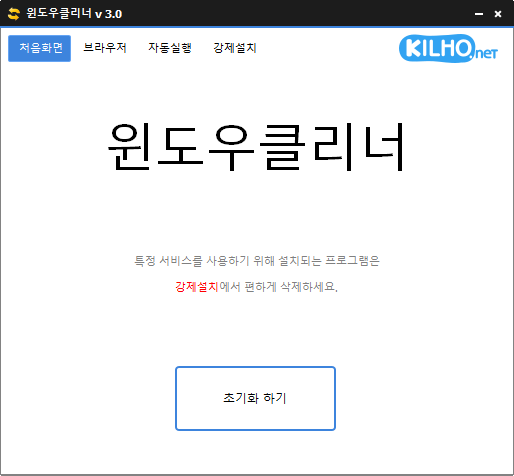

# 윈도우클리너

**버튼 한 번으로 Windows 에 꼭 필요한 것만 남기고 불필요한 프로그램을 모두 종료하고, 자동 실행 항목 · 찌꺼기 파일 · 강제로 설치된 보안 프로그램까지 한자리에서 정리하는 Windows 무료 PC 정리 도구.**

[English](README.md) · 한국어 · [简体中文](README.zh-CN.md) · [日本語](README.ja.md) · [Español](README.es.md) · [Português (Brasil)](README.pt-BR.md) · [Français](README.fr.md)

-0078D4)

## 개요

컴퓨터를 오래 켜 두면 메신저, 업데이트 도우미, 쓰고 닫지 않은 프로그램, 은행 사이트가 깔아 둔 보안 프로그램까지 수많은 프로그램이 뒤에서 돌아갑니다. 하나하나 찾아 끄기는 번거롭습니다.

윈도우클리너는 **실행하기** 한 번으로 Windows 가 동작하는 데 꼭 필요한 프로그램만 남기고 나머지를 모두 종료한 뒤, 남은 메모리를 한 번 더 비웁니다. 그래픽 · 사운드 같은 필수 드라이버와 신뢰할 수 있는 백신은 종료하지 않고, Windows 기본 프로그램과 같은 이름으로 위장한 프로그램은 종료합니다. 프로그램은 종료만 할 뿐 지우지 않습니다.

여기에 세 가지 정리 도구가 탭으로 함께 들어 있습니다.

- **자동실행** — 부팅할 때 저절로 켜지는 프로그램 · 예약 작업 · 서비스를 지우지 않고 꺼 둡니다.
- **파일정리** — 설치된 앱이 남긴 캐시 · 임시 파일 같은 찌꺼기를 골라 지웁니다.
- **강제설치** — 은행 · 공공기관 사이트가 설치를 요구한 보안 프로그램을 찾아 제거합니다.

## 주요 기능

- **한 번에 종료** — 필수 프로그램만 남기고 나머지 프로그램을 버튼 하나로 종료합니다.
- **안전한 기준** — Windows 필수 프로그램, 그래픽 · 사운드 드라이버, 신뢰할 수 있는 백신은 남깁니다. 이름만 흉내 낸 가짜 시스템 프로그램은 종료합니다.
- **메모리 정리** — 종료가 끝나면 남은 메모리를 한 번 더 비웁니다.
- **예외목록** — 늘 켜 두어야 하는 프로그램은 직접 지정해 종료 대상에서 뺄 수 있습니다.
- **정리 결과** — 정리가 끝나면 종료한 프로그램과 메모리 변화를 보여 주는 결과 페이지가 열립니다.
- **자동 실행 관리** — 시작폴더 · 레지스트리 · 예약작업 · 서비스에 흩어진 자동 실행 항목을 한 목록에서 끄고 켭니다.
- **찌꺼기 파일 정리** — 이 PC 에 설치된 앱만 골라 캐시 · 임시 파일 · 로그를 분석하고 지웁니다. 북마크 · 비밀번호 · 방문 기록 같은 개인 기록은 기본으로 체크하지 않습니다.
- **강제 설치 프로그램 제거** — 은행 · 공공기관 보안 프로그램을 찾아 목록으로 보여 주고, 버튼 하나로 제거 프로그램을 실행합니다.
- **트레이 아이콘** — 설치판은 로그인하면 알림 영역에 아이콘으로 대기하다가, 누르면 바로 열립니다.
- **다크 모드** — Windows 의 앱 모드(밝게 · 어둡게)를 따라 화면 색이 바뀝니다.
- **9개 언어** — 한국어 · 영어 · 일본어 · 중국어 · 러시아어 · 이탈리아어 · 프랑스어 · 스페인어 · 아랍어.

## 다운로드 / 설치

| 종류 | 링크 |
|---|---|
| 설치판 | [다운로드](https://down.kilho.net/kcleaner?lang=ko) |
| 무설치판 (ZIP) | [다운로드](https://down.kilho.net/kcleaner?lang=ko&nosetup) |

설치판은 설치가 끝나면 윈도우클리너를 바로 실행하고, 알림 영역에 트레이 아이콘을 올립니다. 무설치판은 ZIP 을 풀고 `KCleaner.exe` 를 실행하면 됩니다. 정리 기능은 두 판이 같고, 트레이 아이콘은 설치판에만 있습니다.

프로그램을 종료하고 자동 실행 항목을 바꾸려면 관리자 권한이 필요하므로, 실행할 때 Windows 가 관리자 권한 확인 창을 띄웁니다. **예** 를 누르면 됩니다.

## 사용법

### 처음 사용하기

1. 열어 둔 문서나 작업이 있으면 먼저 저장합니다. 브라우저와 메신저를 포함해 필수가 아닌 프로그램은 모두 종료됩니다.
2. 윈도우클리너를 실행하고 관리자 권한 확인 창에서 **예** 를 누릅니다.
3. **처음화면** 에서 **실행하기** 를 누릅니다.
4. 버튼 자리에 진행 표시가 돌고, 그동안 불필요한 프로그램을 종료하고 메모리를 정리합니다.
5. 정리가 끝나면 브라우저에 정리 결과 페이지가 열리고 윈도우클리너 창은 저절로 닫힙니다.

### 화면 구성

| 요소 | 역할 |
|---|---|
| **처음화면** | **실행하기** 버튼이 있는 첫 화면 |
| **자동실행** | 부팅할 때 켜지는 항목을 끄고 켜는 화면 |
| **파일정리** | 설치된 앱의 찌꺼기 파일을 분석하고 지우는 화면 |
| **강제설치** | 은행 · 공공기관 보안 프로그램을 제거하는 화면 |
| KILHO.net 로고 | 윈도우클리너 소개 페이지를 엽니다 |

탭은 처음 누를 때 목록을 불러옵니다. **실행하기** 만 쓸 때는 다른 탭을 열 필요가 없습니다.

**자동실행**

| 요소 | 역할 |
|---|---|
| **프로그램 이름** 열 | 프로그램 아이콘과 이름 (제품 이름이 있으면 제품 이름) |
| **출처** 열 | 그 항목이 등록된 곳 — **시작폴더** · **레지스트리** · **예약작업** · **서비스** |
| 흐린 줄 | **사용안함** 상태인 항목 |
| **전체목록** | 체크하면 꺼 둔 항목까지 모두 보여 줍니다 |
| **사용안함** / **사용함** | 고른 항목을 끄거나 켭니다 |
| 오른쪽 클릭 메뉴 | **삭제**(꺼 둔 항목만) · **목록 저장** |

**파일정리**

| 요소 | 역할 |
|---|---|
| 분류 줄 | **윈도우** · 브라우저 이름 · **인터넷** · **멀티미디어** · **유틸리티** · **응용 프로그램** · **게임** · **기타**. 누르면 펼치고 접습니다 |
| 항목 줄 | 지울 수 있는 찌꺼기 한 가지. 체크한 것만 분석 · 정리합니다 |
| 느낌표 표시 | 지우기 전에 주의가 필요한 항목. 마우스를 올리면 설명(영어)이 나옵니다 |
| **크기** 열 | **분석** 뒤에 지울 수 있는 크기 |
| 아래쪽 글 | 설치된 앱 수, 진행 상황, 분석 · 정리 결과 |
| **분석** / **정리하기** | 지울 것을 찾아 크기를 보여 줍니다 / 분석한 것을 지웁니다 |
| 오른쪽 클릭 메뉴 | **모두 선택** · **모두 해제** · **기본값으로** |

**강제설치**

| 요소 | 역할 |
|---|---|
| **프로그램 이름** 열 | 이 PC 에 설치된 은행 · 공공기관 보안 프로그램 |
| **출처** 열 | 만든 회사 (정보가 없으면 **알수없음**) |
| **삭제하기** | 고른 프로그램의 제거 프로그램을 실행합니다 |

### 이럴 때 이렇게

**컴퓨터가 느려졌을 때 한 번에 정리하기**
**처음화면** 에서 **실행하기** 를 누르면 됩니다. 뒤에서 돌던 프로그램이 한꺼번에 종료되고 메모리가 비워집니다. 프로그램은 종료만 될 뿐 지워지지 않으므로, 필요한 프로그램은 다시 실행해서 그대로 쓰면 됩니다.

**실행하기 전에 챙길 것**
브라우저, 메신저, 문서 편집기처럼 필수가 아닌 프로그램은 열려 있어도 종료됩니다. 저장하지 않은 작업이 있으면 먼저 저장하세요. Windows 탐색기와 바탕 화면, 그래픽 · 사운드 드라이버, 신뢰할 수 있는 백신은 그대로 남습니다.

**늘 켜 두어야 하는 프로그램이 있을 때 (예외목록)**
설치판이라면 알림 영역의 윈도우클리너 아이콘을 오른쪽 클릭 → **예외목록** 을 누릅니다. 메모장이 열리면 종료하지 않을 프로그램을 한 줄에 하나씩 적고 저장합니다.

- `프로그램.exe*` — 실행 파일 이름이 정확히 같은 프로그램 (예: `editplus.exe*`)
- `*` 없이 적으면 — 그 글자가 경로에 들어 있는 프로그램 모두 (예: `\EditPlus\` 는 그 폴더의 프로그램 전부)

다음에 **실행하기** 를 누를 때부터 적은 프로그램은 종료하지 않습니다. 무설치판은 `KCleaner.exe` 옆에 `NoClean.txt` 를 만들어 같은 방식으로 적으면 됩니다.

**정리 결과 확인하기**
정리가 끝나면 브라우저에 결과 페이지가 열려, 종료한 프로그램과 정리 전후의 메모리를 보여 줍니다. 윈도우클리너 창은 할 일을 마치면 저절로 닫힙니다.

**트레이 아이콘으로 바로 실행하기**
설치판은 로그인하고 잠시 뒤 알림 영역에 윈도우클리너 아이콘이 올라옵니다. 아이콘을 왼쪽 클릭하면 윈도우클리너가 열리고, 이미 열려 있으면 그 창이 앞으로 나옵니다. 오른쪽 클릭 메뉴에는 **윈도우클리너** · **예외목록** · **만든이 오길호** · **종료하기** 가 있습니다. **종료하기** 를 누르면 아이콘은 다음 로그인 때까지 사라집니다.

**부팅할 때 저절로 켜지는 프로그램 끄기**
**자동실행** 탭에서 그 프로그램을 누르고 **사용안함** 을 누릅니다. 항목을 지우는 것이 아니라 꺼 두는 것이라, 다음 부팅부터 켜지지 않을 뿐 프로그램은 그대로 쓸 수 있습니다. 그 줄은 흐린 채로 자리에 남아 있어 바로 **사용함** 으로 되돌릴 수도 있습니다.

**꺼 둔 항목을 다시 켜고 싶을 때**
**자동실행** 탭에서 **전체목록** 을 체크하면 예전에 꺼 둔 항목이 흐린 줄로 함께 나옵니다. 그 줄을 누르고 **사용함** 을 누르면 다음 부팅부터 다시 실행됩니다.

**업데이트 예약 작업과 서비스 끄기**
**출처** 가 **예약작업** 인 줄은 정해진 때에 저절로 실행되는 작업이고, **서비스** 는 Windows 가 시작될 때 켜지는 백그라운드 서비스입니다. **사용안함** 을 누르면 예약 작업은 정해진 때가 와도 실행되지 않고, 서비스는 부팅 때도 다른 프로그램이 불러도 켜지지 않습니다. 서비스는 어떤 프로그램이 쓰는 것인지 확인하고 끄는 것이 좋습니다.

**자동실행 항목이 무엇인지 모를 때**
그 줄을 더블클릭하면 브라우저가 열리고 그 항목에 대한 정보를 찾아 보여 줍니다.

**지운 프로그램의 자동 실행 항목이 남아 있을 때**
먼저 그 줄을 **사용안함** 으로 바꾼 뒤 오른쪽 클릭 → **삭제** 를 누르고 확인 창에서 **예** 를 누릅니다. 삭제한 항목은 되돌릴 수 없으므로 확실히 필요 없는 것만 지우세요. 서비스를 지우면 "실행 중이던 서비스는 재부팅 후 완전히 제거됩니다" 라는 안내가 뜨는데, 컴퓨터를 한 번 다시 시작하면 깨끗이 정리됩니다.

**자동 실행 목록을 파일로 남기기**
**자동실행** 탭에서 오른쪽 클릭 → **목록 저장** 을 누르면, 목록에 보이지 않는 Windows 기본 항목까지 포함한 자동 실행 항목 전체가 텍스트 파일로 저장됩니다. Windows 가 꼭 필요로 하는 서비스와 작업은 실수로 끄지 않도록 처음부터 목록에서 숨겨 두었고, **전체목록** 을 체크해도 나오지 않습니다.

**찌꺼기 파일로 디스크 공간 되찾기**
**파일정리** 탭을 처음 열면 이 PC 에 설치된 앱을 찾아 **설치된 앱 N개** 로 알려 주고, 그 앱들의 정리 항목만 분류별로 보여 줍니다. 기본으로 체크된 그대로 **분석** 을 누르면 지울 파일과 크기가 나오고, **정리하기** 를 누르면 분석한 것을 지웁니다. **분석** 은 아무것도 지우지 않으니 얼마나 비울 수 있는지만 먼저 확인해도 됩니다.

**지울 항목 직접 고르기**
분류 줄을 누르면 펼쳐져 항목이 보이고, 항목 줄을 누르면 체크가 바뀝니다. 분류 줄의 체크 칸은 그 분류 전체를 한 번에 체크하거나 해제하며, 일부만 체크돼 있으면 회색으로 표시됩니다. 바꾼 체크는 기억해 두었다가 다음에 열 때도 그대로 씁니다. 처음 상태로 돌리려면 목록에서 오른쪽 클릭 → **기본값으로** 를 누릅니다.

**방문 기록이나 최근 파일 목록도 지우고 싶을 때**
북마크 · 즐겨찾기 · 비밀번호 · 웹 방문 기록 · 대화 기록처럼 사용자가 남긴 기록은 실수로 지우지 않도록 기본으로 체크하지 않습니다. 캐시와 최근 파일 목록이 섞인 앱은 **… · 사용 기록** 이라는 항목을 따로 두었습니다. 기록까지 지우고 싶으면 그 항목을 직접 체크하세요.

**정리하기가 눌리지 않을 때**
**정리하기** 는 체크한 항목을 모두 **분석** 했고 지울 것이 있을 때만 켜집니다. 분석한 뒤에 새로 체크했거나 방금 정리를 마쳤다면 **분석** 을 한 번 더 누르세요.

**느낌표가 붙은 항목**
지우기 전에 알아 둘 점이 있는 항목입니다. 마우스를 올리면 설명(영어)이 나오고, 이런 항목이 체크돼 있으면 **정리하기** 를 누를 때 한 번 더 확인합니다.

**브라우저가 열려 있을 때**
지금 쓰는 중인 파일은 건드리지 않고 건너뜁니다. 브라우저 캐시를 더 많이 비우려면 브라우저를 닫고 정리하거나, **처음화면** 의 **실행하기** 를 먼저 누른 뒤 정리하세요.

**내 파일은 안전한가요**
문서 · 바탕 화면 · 사진 · 동영상 · 음악 · 다운로드 폴더와 숨김 · 시스템 파일은 분석도 정리도 하지 않습니다. 정리 목록은 인터넷에 연결돼 있으면 확인을 거친 최신 판으로 저절로 바뀝니다.

**은행 사이트가 깔아 둔 보안 프로그램 지우기**
**강제설치** 탭을 열면 이 PC 에 설치된 키보드 보안 · 공동인증서 · 방화벽 같은 은행 · 공공기관 보안 프로그램만 골라 보여 줍니다. 지울 프로그램을 고르고 **삭제하기** 를 누르거나 그 줄을 더블클릭하면, 제어판의 "프로그램 제거" 와 같은 방식으로 그 프로그램의 제거 프로그램이 열립니다. 제거가 끝나면 목록에서 저절로 빠집니다. 지울 것이 없으면 **삭제할 프로그램이 없습니다** 라고 나옵니다. 필요할 때 사이트에서 다시 설치하면 되므로 부담 없이 지워도 됩니다.

**키보드로 목록 살펴보기**
**자동실행** 과 **강제설치** 탭에서 **↑** · **↓** 로 줄을 옮겨 가며 고를 수 있고, **F5** 는 목록을 새로 불러옵니다. 이름이 길어 잘려 보이면 열 제목 사이 경계를 끌어 열 폭을 맞출 수 있습니다.

**이미 실행 중인데 또 실행했을 때**
윈도우클리너는 하나만 실행됩니다. 창이 열려 있는 상태에서 다시 실행하면 새로 켜지지 않고, 이미 열린 창이 앞으로 나옵니다.

## 설정

따로 설정할 것이 없습니다. 종료하지 않을 프로그램은 위의 **예외목록** 으로, 파일정리의 체크는 화면에서 바꾸면 저절로 기억됩니다. 아래는 윈도우클리너가 알아서 따릅니다.

| 항목 | 따르는 것 |
|---|---|
| 언어 | Windows 지역 설정 (지원하지 않는 언어면 영어) |
| 화면 색 | Windows 앱 모드 (밝게 · 어둡게) — 윈도우클리너가 켜져 있는 동안 바꿔도 바로 따라갑니다 |

## 요구 사항

- Windows 10 · Windows 11 (64비트)
- 관리자 권한 — 프로그램 종료와 자동 실행 항목 변경에 필요합니다. 실행할 때 확인 창이 뜹니다.
- 따로 설치할 구성 요소는 없습니다.
- 인터넷 연결은 새 버전 안내, 목록 갱신, 정리 결과 페이지에 씁니다. 연결이 없어도 내장된 목록으로 정리는 그대로 됩니다.

## 업데이트

윈도우클리너는 스스로 업데이트하지 **않습니다**. 실행할 때 새 버전이 있는지 확인해 안내 창을 띄우고, **[예]** 를 누르면 다운로드 페이지를 열고 프로그램을 닫습니다. 새 버전은 내부 검증을 거쳐 수동으로 배포되며 [윈도우클리너 페이지](https://kilho.net/kcleaner)에 공지됩니다. [업데이트 정책 안내](https://kilho.net/archives/notice/2940)를 참고하세요.

## 라이선스

윈도우클리너는 **프리웨어**입니다. 회사, 집, 관공서, 학교 등 어디서나 제약 없이 무료로 쓸 수 있고, 자유롭게 재배포할 수 있습니다.

파일정리 목록은 [Winapp2](https://github.com/MoscaDotTo/Winapp2)(CC BY-SA 4.0)를 바탕으로 합니다. 함께 쓰는 구성 요소의 라이선스는 설치 폴더의 `THIRD-PARTY-NOTICES.txt` 에 있습니다.

## 링크

- 웹사이트: <https://kilho.net/kcleaner>
- 포럼: <https://kilho.top/forum/qna>
- X (Twitter): <https://www.twitter.com/kilhonet>

© KILHO.NET
